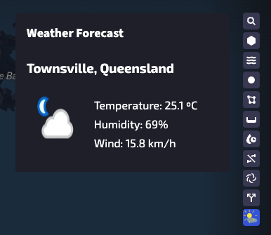

# Weather integration plugin

A plugin showcasing how to integrate with a third party weather forecast API.



## Running the plugin

Start the development server
```bash
npm install
npm run dev
```

Open Qatium in developer mode to see your changes, to do so:
- Open the Qatium web app
- Open a network and wait for it to load
- Open your user menu clicking in your avatar, then open the developer mode settings and click the “Activate” toggle

You should see your new plugin in the right side panel.
