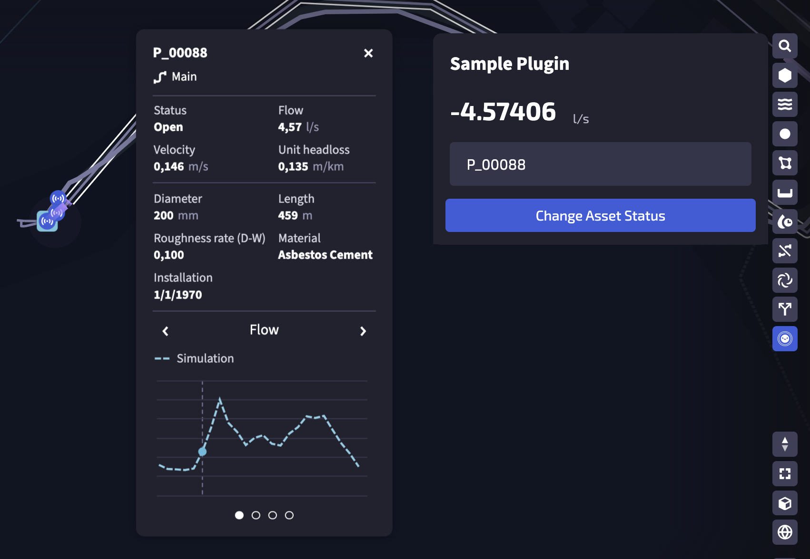
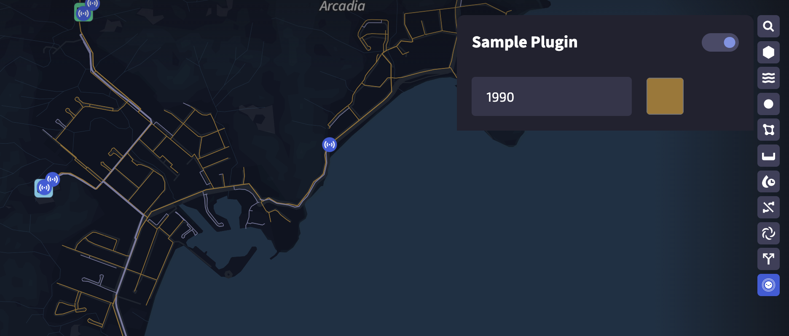
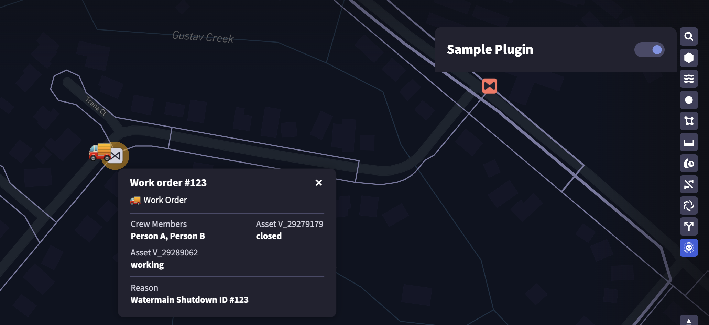
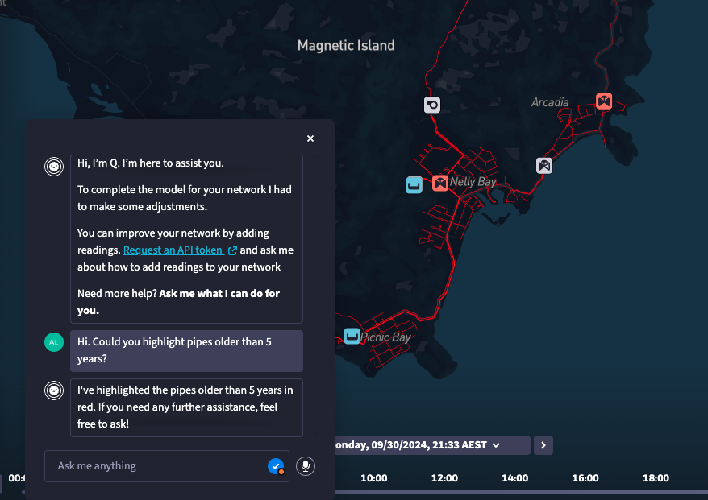
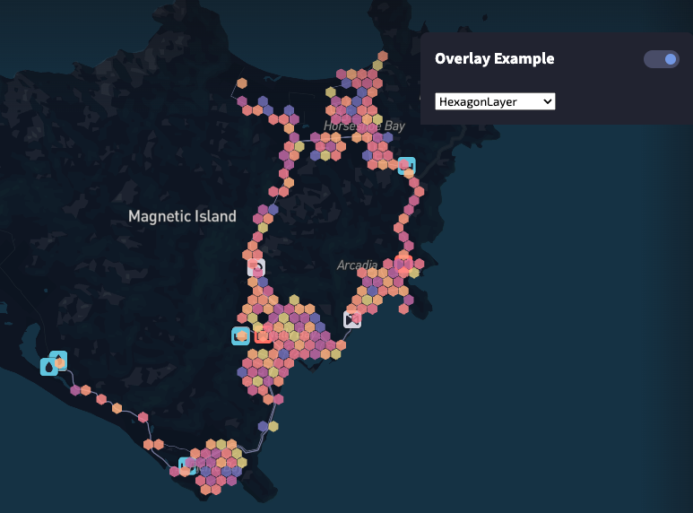

### Plugin Examples

Plugin examples to showcase the SDK functionality.

### 1. Build first plugin

A simple plugin showcasing how to connect the plugin with the UI panel, how to query the network model and how to apply changes to the model.

After enabling developer mode in Qatium, run with
```
npm build
npm run dev
```



### 2. Extend map visuals

A plugin showcasing how to change base map visuals given a condition. In this case, pipes installed before the date introduced in the panel are shown in orange.

After enabling developer mode in Qatium, run with
```
npm build
npm run dev
```



### 3. Integrate external service

This plugin consumes fake work order data from a stubbed API. It showcases how to access an external service and apply model and map changes given the data received from the external API

In this case, the status of a network operator van is tracked in the map, and accessible through a popover. When a valve becomes closed due to the operator action, it gets closed in the model too

The fake API rotates the response in order every few seconds, from the ones in the `data.json` file

After enabling developer mode in Qatium, run with
```
npm build
npm run dev
```

Run the fake API with
```
node api.js
```



### 4. Integrate AI assistant

Works exactly like the number 2 plugin (Extend map visuals), but showcases how to add AI integration to use the plugin from Q assistant.

After enabling developer mode in Qatium, run with
```
npm build
npm run dev
```



### 5. Map Overlays

This example showcases how different layers can be used as overlays, to display content on the map.

After enabling developer mode in Qatium, run with
```
npm build
npm run dev
```

